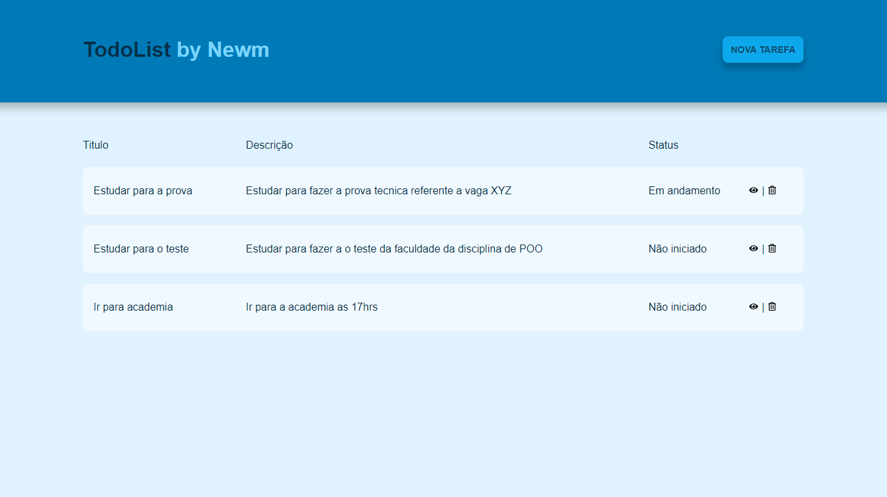
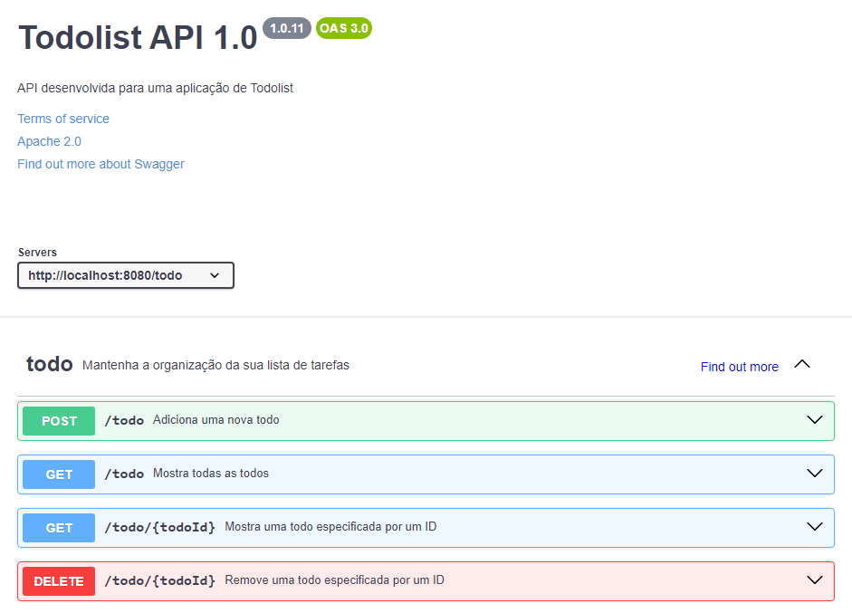

<h1 align="center">Todo List Challenge</h1>



## 📖 Sobre

Trata-se de um todo list, proposto para um desafio técnico de um vaga.

## 🔧 Como executar o projeto

Clone o projeto e acesse a pasta

```bash
$ git clone https://github.com/DenilsonMelo/todolist.git && cd todolist
```

O projeto pode ser executado localmente com um único comando, para isso é necessário ter o Docker instalado na máquina.

Na raiz do projeto, execute:
```bash
   docker-compose up -d --build
   ```

O front-end estará rodando no endereço http://localhost:3000.<br>
O back-end estará rodando no endereço http://localhost:8080.

## 📃 Descrição do Projeto:
A aplicação desenvolvida tem a seguinte estrutura:

   - Página inicial: traz uma lista com todas as todos, é possivel adicionar uma nova todo, visualizar em um modal uma todo especifica e remover um todo.
   - Ao clicar no botão "Nova tarefa" no Header da aplicação um modal será aberto para a inserção de uma nova todo.
## 🖥️ Tecnologias usadas
1. Front
   - Vite
   - React.js 
   - Styled-components
   - React icons
 
2. Back
   - Java
   - Spring
   - Lombok
   - Flyway
   - Postgres

## ⛳ Endpoints da API
